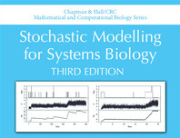

# SMfSB 3e

### Documentation, models and code relating to the 3rd edition of the textbook Stochastic Modelling for Systems Biology

This page contains links, code snippets, software and other information relating to the third edition of the book, Stochastic Modelling for Systems Biology, published by Chapman & Hall/CRC, November 2018.

The book has ISBN-10 **113854928-2** and ISBN-13 **978-113854928-9**. It can be ordered from [CRC Press](https://www.crcpress.com/Stochastic-Modelling-for-Systems-Biology-Third-Edition/Wilkinson/p/book/9781138549289), [Amazon.com](https://amzn.to/2LAVSSN), [Amazon.co.uk](https://amzn.to/2PeDIZt) and similar book sellers.

### New in the third edition

* New chapter on spatially extended systems, covering the spatial Gillespie algorithm for reaction diffusion master equation (RDME) models in 1- and 2-d, the next subvolume method, spatial CLE, scaling issues, etc.
* Significantly expanded chapter on inference for stochastic kinetic models from data, covering approximate methods of inference (ABC), including ABC-SMC. The material relating to particle MCMC has also been improved and extended.
* Updated R package, including code relating to all of the new material
* New R package for parsing SBML models into simulatable stochastic Petri net models
* New software library, written in Scala, replicating most of the functionality of the R packages in a fast, compiled, strongly typed, functional language

### Links

* [Software](Software.md) - installing and running software associated with the book
  * [smfsb](Software.md#r-package---smfsb) (main R package)
  * [smfsbSBML](Software.md#additional-r-package---smfsbsbml) (optional R package)
  * [SBML-shorthand](https://github.com/darrenjw/sbml-sh) (Python translation scripts)
  * [scala-smfsb](https://github.com/darrenjw/scala-smfsb) (Scala library)
* [Models](models/) - Models described in the book, in [SBML](http://sbml.org/Main_Page) and [SBML-shorthand](https://github.com/darrenjw/sbml-sh)
* [Chapter notes](ChapterNotes.md) including web links
  * [Chapter 1: Introduction to biological modelling](ChapterNotes.md#chapter-1-introduction-to-biological-modelling)
  * [Chapter 2: Representation of biochemical networks](ChapterNotes.md#chapter-2-representation-of-biochemical-networks)
  * [Chapter 3: Probability models](ChapterNotes.md#chapter-3-probability-models)
  * [Chapter 4: Stochastic simulation](ChapterNotes.md#chapter-4-stochastic-simulation)
  * [Chapter 5: Markov processes](ChapterNotes.md#chapter-5-markov-processes)
  * [Chapter 6: Chemical and biochemical kinetics](ChapterNotes.md#chapter-6-chemical-and-biochemical-kinetics)
  * [Chapter 7: Case studies](ChapterNotes.md#chapter-7-case-studies)
  * [Chapter 8: Beyond the Gillespie algorithm](ChapterNotes.md#chapter-8-beyond-the-gillespie-algorithm)
  * [Chapter 9: Spatially extended systems](ChapterNotes.md#chapter-9-spatially-extended-systems)
  * [Chapter 10: Bayesian inference and MCMC](ChapterNotes.md#chapter-10-bayesian-inference-and-mcmc)
  * [Chapter 11: Inference for stochastic kinetic models](ChapterNotes.md#chapter-11-inference-for-stochastic-kinetic-models)
  * [Chapter 12: Conclusions](ChapterNotes.md#chapter-12-conclusions)
* [**Errata**](https://darrenjw.github.io/work/smfsb/3e/errata3e.pdf) - list of known errors and typos
* Note that you may wish to [download a copy of this repo](https://github.com/darrenjw/smfsb/archive/master.zip) (or clone it) for off-line use

